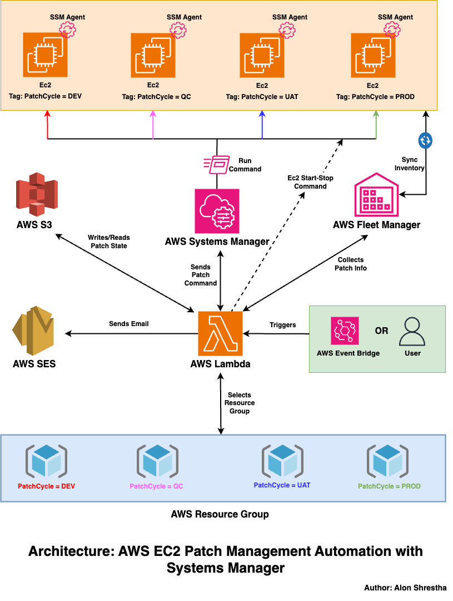
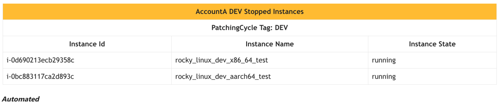
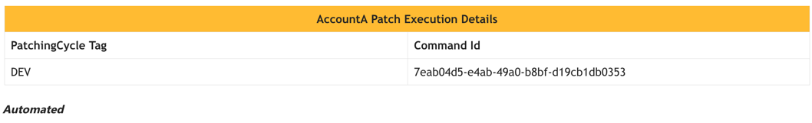
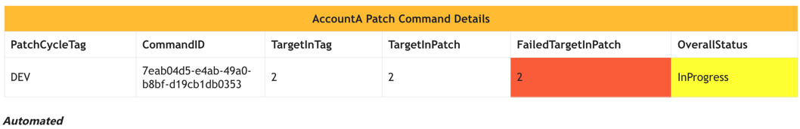
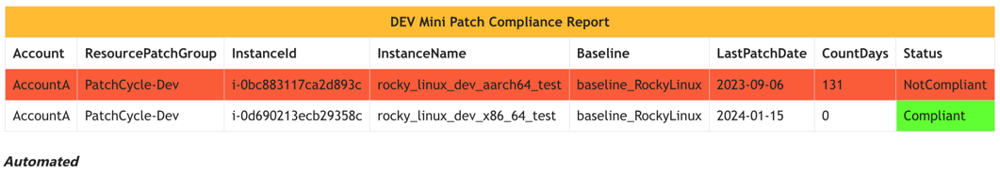
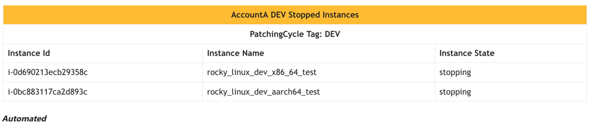

# AWS EC2 Patching Automation Scripts with Generating Reports Using Systems Manager and Boto3

## Overview

This repository provides a flexible patching automation script designed to patch AWS EC2 instances using AWS Systems Manager. The script is capable of patching multiple AWS accounts and allows for organized patching of instances in various environments, such as DEV, QC, UAT, and PROD. It ensures better testing, security, and maintainability.

## Key Features

- **Environment-Based Grouping**: EC2 instances are tagged with a `PatchingCycle` key and values like DEV, QC, UAT, or PROD, enabling organized grouping.

- **Stateful Application**: The script records the patching progress and instance states in an S3 bucket, making it a stateful application.

- **Start/Stop Instance Functionality**: Before and after patching, the script can start and stop instances for seamless operations.

- **Auto Reboot Configuration**: Users can configure auto-reboot or choose not to reboot while patching through AWS Systems Manager.

- **Compliance Tracking**: The script checks the latest patched installed package date from AWS Systems Manager Fleet Manager. Instances are marked as compliant if patched within 60 days; otherwise, they are labeled as non-compliant.

- **Email Notifications**: AWS SES is utilized to send email notifications in a clear table format, making it easy to interpret the patching results.

## Workflow

1. **Tagging Instances**: EC2 instances are tagged with `PatchingCycle` values (DEV, QC, UAT, PROD).
2. **Resource Group Creation**: An AWS Resource Group is created from the tagging, maintaining grouped resources in a config file.
3. **Commands Execution**: The script accepts commands (StartInst, RunPatch, GenerateReport, StopInst) with environment tags (dev, qc, uat, prod), ensuring sequential execution.
4. **Script Commands**:
   - `StartInst`: Selects the AWS resource group and starts any stopped EC2 instances.
   - `RunPatch`: Initiates patching on selected EC2 instances through Systems Manager (concurrently handles up to 50 instances).
   - `GenerateReport`: Generates a comprehensive report on patching status, compliance, and sends an email notification.
   - `StopInst`: Stops instances that were started before the patching operation.

5. **Sequential Execution**: Execute commands sequentially, providing the environment tag (dev, qc, uat, prod).

6. **Environment Selection**: The script identifies the matching environment in the config file, selects the corresponding resource group, and performs operations.

7. **S3 Logging**: Records operation states and stores them in an S3 bucket.

8. **Email Notifications**: Sends emails with operation results (success/fail) and detailed reports.

## Architecture Diagram


## Project Structure

- **controller.py**: The main file handling commands, validating inputs, and calling scripts from the core directory.
- **Core Directory**: Contains sub-scripts calling modules from the library and config directories.
- **Library Directory**: Modules for start/stop/patch/generate report operations.
- **Config Directory**: Configuration details such as resources.

## Technology Stack

- Python
- Boto3
- AWS EC2
- AWS Lambda
- AWS Systems Manager
- AWS Resource Group
- AWS S3
- AWS Simple Email Service (SES)

## Usage

1. Clone the repository.
2. Update details in `config/resourceConfig.py`.
   - Account Config
      ```python
      resources = {
       "AccountA": 
           {
               "id": "123XXXXXX89",
               "region": "us-east-1",
               "ResourceGroupTag": {
                   "DEV": ['PatchCycle-Dev'],
                   "QC": ['PatchCycle-QC'],
                   "UAT": ['PatchCycle-UAT'],
                   "PROD": ['PatchCycle-PROD']
               },
               "AssumeIAMRole": "arn:aws:iam::123XXXXXX89:role/access_cross_account_example"

           }
      }
      ```
     - Similarly update other config for email, s3bucket and max retries count.
3. Uncomment the `mainHandler()` function call in `controller.py` and provide necessary parameters for manual testing. 
   ```python
     mainHandler(
    {
        "stringParameters": {
            "action": "StartInst",
            "environment": "DEV",
            "account": ["AccountA"]
        }
    },
    ""
)

4. For automation, set up AWS Lambda, install dependencies with `requirements.txt`, configure EventBridge, and set parameters.
5. Install required libraries:
   ```bash
   pip install -r requirements.txt
   ```   

## Before Use

Ensure:
- Proper access to required AWS services.
- Resources are appropriately tagged and grouped.

## Email Notification Screenshot
1 **Start Instance**


2 **Patch Execution**


3 **Patch Status**


4 **Patch Report**


5 **Stop Instance**



## License

This script is licensed under the [MIT License](LICENSE).


## Usage Disclaimer and Considerations

- This application is a basic example and may require modifications based on specific use cases or security considerations.
- Refer to the [boto3 documentation](https://boto3.amazonaws.com/v1/documentation/api/latest/index.html) for more information.
- **Important**: Thoroughly test before deploying in a production environment to ensure it meets specific requirements without unintended consequences.

---